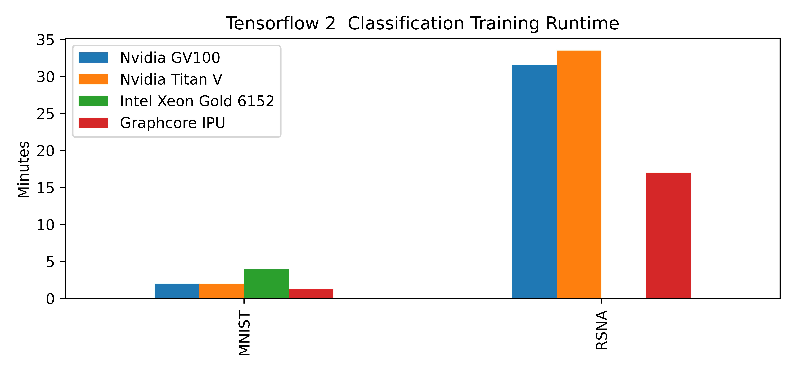
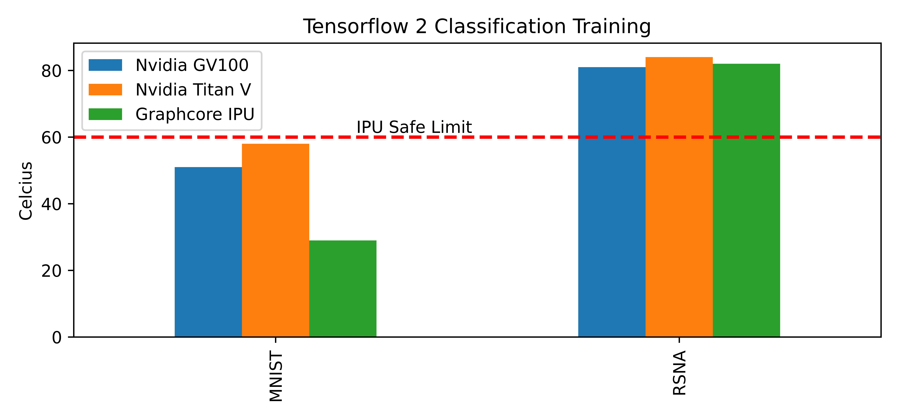

# Graphcore Internal Benchmark

This repository contains a example code of Tensorflow benchmark on [graphcore](https://www.graphcore.ai/) Intelligence Processing Unit (IPU) on their [Poplar SDK](https://www.graphcore.ai/products/poplar)

> The code presented here requires using Poplar SDK 3.1.0, and has been tested using Ubuntu 20.04 and Python 3.8.10

## Introduction
Many artificial intelligence (AI) devices have been developed to accelerate the training and inference of neural network models. The most common ones are the Graphics Processing Unit (GPU) and Tensor Processing Unit (TPU).[^1] Existance and success of these devices are largely driven from availibility of novel deep learning models and large-scale datasets.

Graphcore IPU emphasis is on fine-grained parallelism which means that the IPU can efficiently run applications that have irregular and sparse data access patterns and control flow.[^2] 

In the internal report, it was mentioned that IPU offers an impressive arithmetic (for Dense matrix multiplication) throughput, up to 31.1 TFlops/s in single precision and 124.5 TFlops/s in mixed precision per chip, surpassing the GPU's theoretical limits. Actual performance measured on GEMM benchmarks show the IPU as a clear winner in single precision against NVidia's V100 GPU. In mixed precision, the comparison does not yield a clear winner.

## Workspace setup

---

This repo was tested with the following requirement:

+ Ubuntu 20.04.5 LTS
+ Python 3.8.10
+ NVIDIA Driver 525.60.11
+ CUDA 11.2
+ cuDNN 8.1.1

Our testbench is the following:

+ Intel Xeon Gold 6152, 3.7 GHz (88 cores)
+ Mobo WS-C621E-SAGE Series
+ 64 GiB DDR4 (2666MHz)
+ Samsung SSD 960 PRO 1TB
+ NVIDIA GeForce Titan V, 12GB
+ NVIDIA Quadro GV100, 32GB
+ Graphcore IPU

---

### </a> Computer Vision 

| Model | Domain | Type |
| ------- | ------- |------- | 
| Simple MNIST CovNet | Image Classification | Training |

The result for Simple MNIST CovNet Training (with > 90% accuracy) is as follows:

| Model | GV 100 | IPU | Titan V | CPU (88 Cores) |
| ------- | ------- |------- | ------- | ------- |
| Runtime (Wall Time) | 2m 0.190s | 1m 26.398s | 2m 0.039s | 4m 15.376s |
| Card Temperature | 51 C | 29 C | 58 C | N/A |

| Model | Domain | Type |
| ------- | ------- |------- | 
| Simple CNN | Image Classification | Inference |

The result is as follows:

| Model | GV 100 | IPU | Titan V | CPU (88 Cores) |
| ------- | ------- |------- | ------- | ------- |
| Wall time for Load model + Inference 1 image | 10.515s | 5.574s | 9.878s | 9.897s |

---

### </a> Computer Vision 

| Model | Domain | Type |
| ------- | ------- |------- | 
| Deep CNN ([RSNA Dataset](https://www.kaggle.com/competitions/rsna-breast-cancer-detection)) | Image Classification | Training | 

The result for Deep CNN (RSNA Dataset) Training (with > 60% accuracy) is as follows:

| Model | GV 100 | IPU | Titan V | CPU (88 Cores) |
| ------- | ------- |------- | ------- | ------- |
| Runtime (Wall Time) | 31.5m | 17m | 33.5m | > 13 hours |
| Card Temperature | 81 C | 82 C | 84 C | N/A |

---

Visualize the result:

> Note: Other micro-benchamark were not done due Twistcode forte is on computer vision.

## Reference

[^1]: [Benchmarking GPU and TPU Performance with Graph Neural Networks](https://arxiv.org/pdf/2210.12247.pdf)
[^2]: [Dissecting the Graphcore IPU Architecture via Microbenchmarking](https://www.graphcore.ai/hubfs/assets/pdf/Citadel%20Securities%20Technical%20Report%20-%20Dissecting%20the%20Graphcore%20IPU%20Architecture%20via%20Microbenchmarking%20Dec%202019.pdf?hsLang=en)
